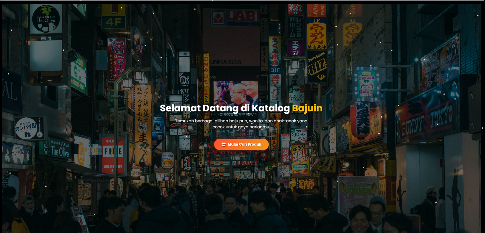
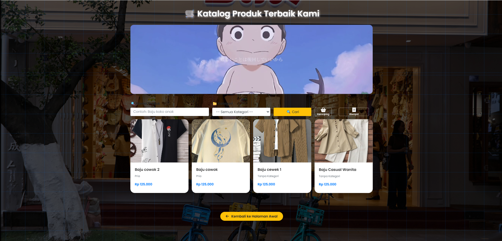
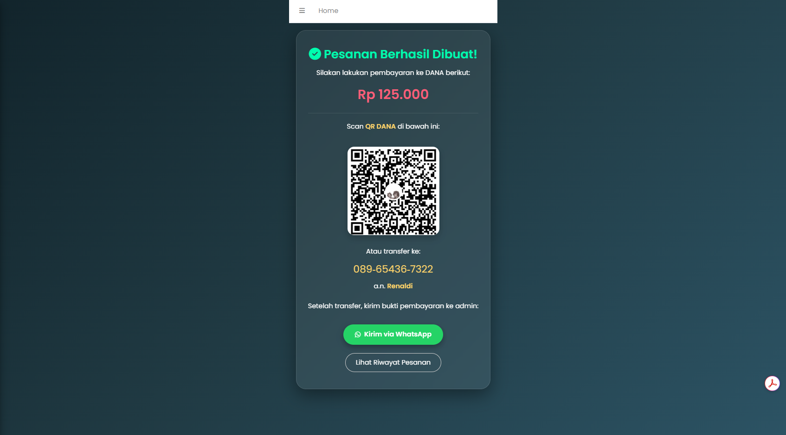
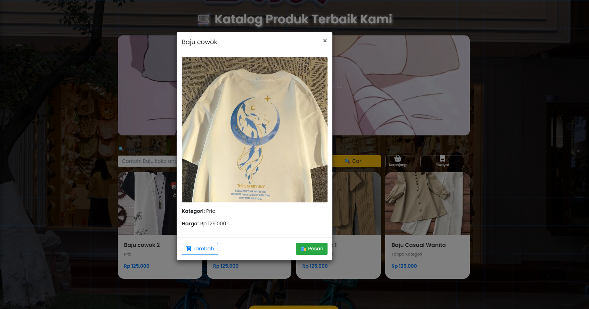

# 👕 Katalog Baju

A modern Laravel-based clothing catalog app for managing products, categories, shopping cart, and checkout system.


## ✨ Fitur Utama

- 🔐 Login & Register (Admin & User)
- 📦 CRUD Produk & Kategori
- 🛒 Keranjang Belanja & Checkout Otomatis
- 📜 Riwayat Pesanan (User & Admin)
- 🎨 UI modern & responsif (dengan AdminLTE dan animasi)

## 📸 Screenshots







## 🚀 Cara Install

```bash
git clone https://github.com/renal36/katalog_baju.git
cd katalog_baju
composer install
cp .env.example .env
php artisan key:generate
php artisan migrate --seed
php artisan serve


👥 Tim Pengembang
Proyek ini dikerjakan oleh 4 orang dalam 1 tim UAS:

👨‍💻 Renal 

👨‍💻 Yusuf

👨‍💻 Doni

👨‍💻 Dafi


