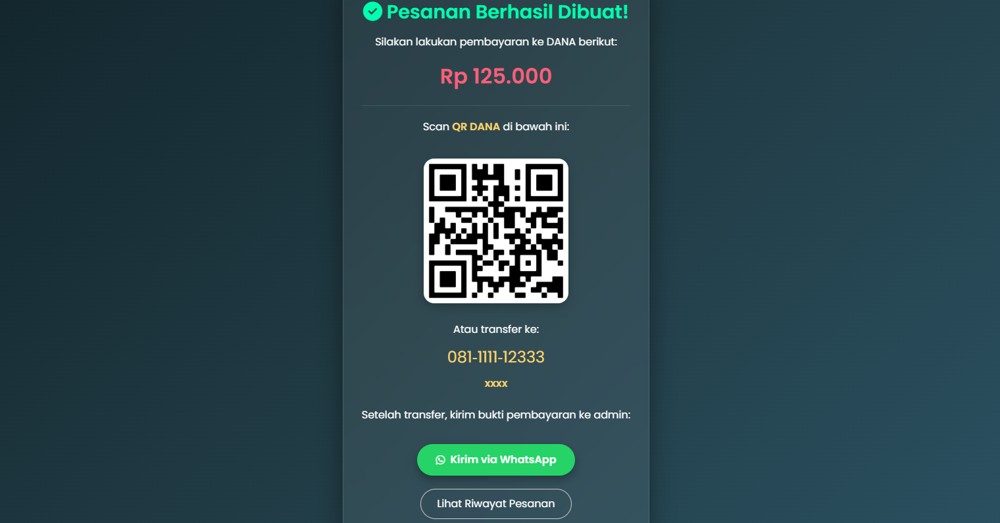
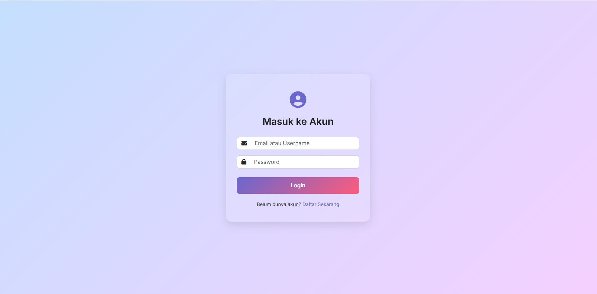
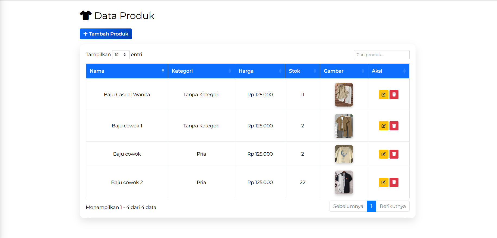

#  Katalog Bajuin

A modern Laravel-based catalog app to manage products, categories, shopping cart, and transaction system with QR checkout and animations.

---

## 🖼️ Tampilan WEB (Screenshots)

<table>
  <tr>
    <td></td>
    <td></td>
  </tr>
  <tr>
    <td></td>
    <td></td>
  </tr>
  <tr>
    <td colspan="2"></td>
  </tr>
  <tr>
    <td></td>
    <td></td>
  </tr>
</table>
---

✨ Fitur Unggulan

🔐 Login & Register untuk Admin dan User

🧥 CRUD Produk & Kategori

🛒 Keranjang Belanja

📜 Riwayat Pesanan terpisah untuk User & Admin

💳 Checkout via Scan QR Code

🎞️ Tampilan Header dengan Video Animasi

🎨 UI modern (AdminLTE + animasi warna)

🔍 Pencarian & Filter Produk berdasarkan nama dan kategori

## 👥 Tim Pengembang

Proyek ini dikerjakan oleh 4 orang dalam satu tim UAS:

| Nama   | Peran               |
|--------|---------------------|
| 👨‍💻 Doni   | Project Manager       |
| 👨‍💻 Renal  | Front-End Developer   |
| 👨‍💻 Yusuf  | Back-End Developer    |
| 👨‍💻 Dafi   | perancangan & Database  |

---

## 📜 Lisensi

Proyek ini menggunakan lisensi [MIT License](LICENSE).

